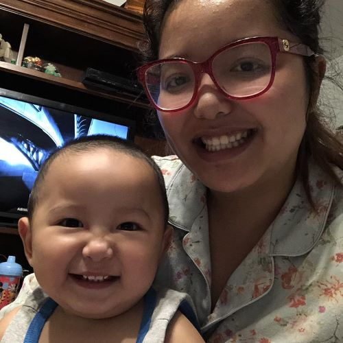

# Basic-Portfolio
<!DOCTYPE html>
<html lang="en">
<head>   
    <title>Nancy's Basic Portfolio</title>
    <meta charset="UTF-8">
    <link rel="contact.html">
    <link rel="Portfolio.html">
    

</head>

<body>
    <header>
        <h1>Nancy Ta</h1>
    </header>
    <a>
        <link:contact class="html"></link:contact>
    </a>

    <button type="button" class="contact.html">contact</button>
    <link rel="contact" href="contact.html">

    <a>
        <link:portfolio class="html"></link:portfolio>
    </a>

    <button type="button" class="portfolio.html">portfolio</button>
        <link rel="portfolio" href="portfolio.html">

    

        <section id="main-bio">
            <h2>About Me</h2>

        
        
    

        

        My name is Nancy Ta, I was born and raise in North Philadelphia.
        I currently am a salon owner. I have a son and happily married. I like to 
        to travel. I been to: Singapore, Thailand, Vietnam, Australia mostly in Sydney 
        or Adelaide, and Canada. I like to play Badminton, tennis, and street hockey.
        I'm very competitive and so is my husband. we keep each other on our toes.
        I love spending time with my son, we would go on an adventure every week.
        so far, he been my traveling buddy along with my husband to Georgia, and New Orleans.
        In the near future, we are planning to bring him on a Disney Cruise for his 3rd birthday. 
        Hopefully all goes well!

        

    

    </body>
    <footer>
        

            The End
        

        
    </footer>
    </html>